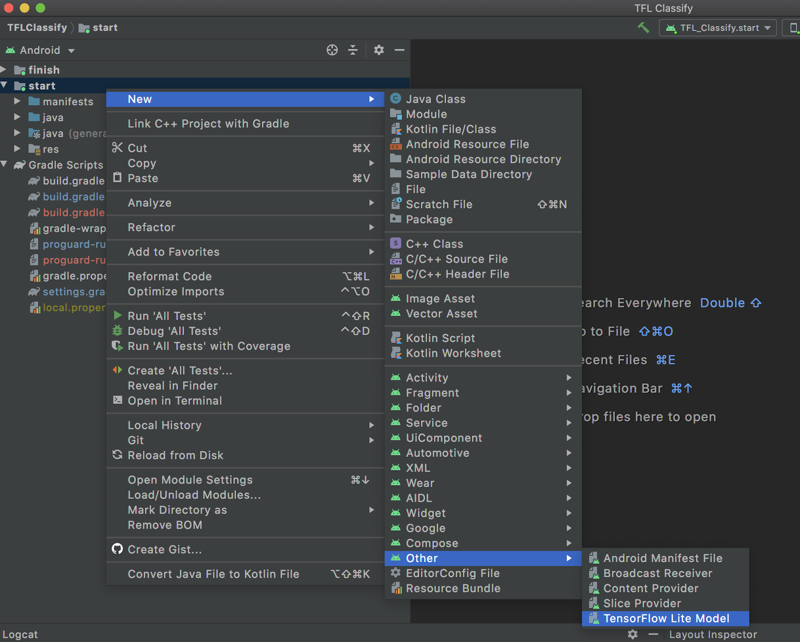
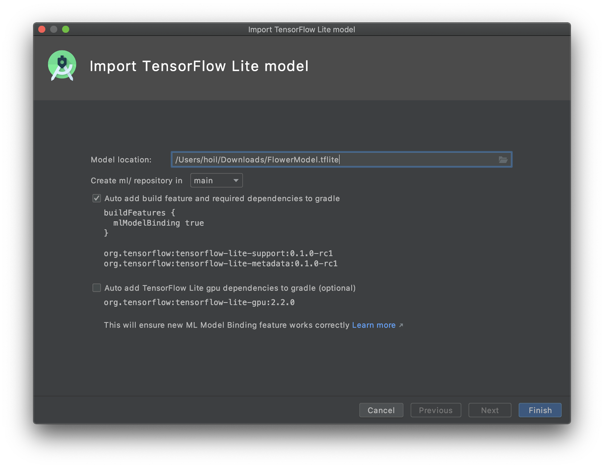
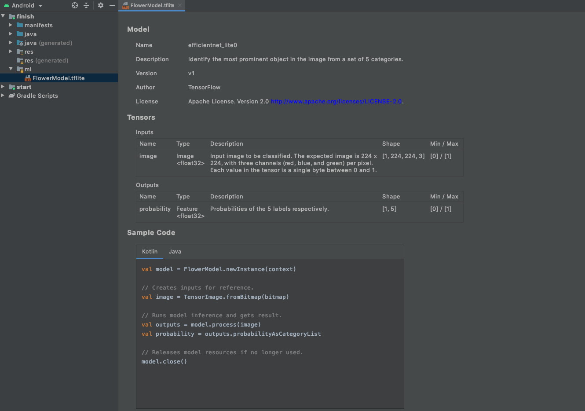

# Android quickstart

To get started with TensorFlow Lite on Android, we recommend exploring the
following example.

<a class="button button-primary" href="https://github.com/tensorflow/examples/tree/master/lite/examples/image_classification/android">Android
image classification example</a>

Read
[TensorFlow Lite Android image classification](https://github.com/tensorflow/examples/blob/master/lite/examples/image_classification/android/EXPLORE_THE_CODE.md)
for an explanation of the source code.

This example app uses
[image classification](https://www.tensorflow.org/lite/models/image_classification/overview)
to continuously classify whatever it sees from the device's rear-facing camera.
The application can run either on device or emulator.

Inference is performed using the TensorFlow Lite Java API and the
[TensorFlow Lite Android Support Library](../inference_with_metadata/lite_support.md).
The demo app classifies frames in real-time, displaying the top most probable
classifications. It allows the user to choose between a floating point or
[quantized](https://www.tensorflow.org/lite/performance/post_training_quantization)
model, select the thread count, and decide whether to run on CPU, GPU, or via
[NNAPI](https://developer.android.com/ndk/guides/neuralnetworks).

Note: Additional Android applications demonstrating TensorFlow Lite in a variety
of use cases are available in
[Examples](https://www.tensorflow.org/lite/examples).

## Build in Android Studio

To build the example in Android Studio, follow the instructions in
[README.md](https://github.com/tensorflow/examples/blob/master/lite/examples/image_classification/android/README.md).

## Create your own Android app

To get started quickly writing your own Android code, we recommend using our
[Android image classification example](https://github.com/tensorflow/examples/tree/master/lite/examples/image_classification/android)
as a starting point.

The following sections contain some useful information for working with
TensorFlow Lite on Android.

### Use Android Studio ML Model Binding

Note: Required [Android Studio 4.1](https://developer.android.com/studio) or
above

To import a TensorFlow Lite (TFLite) model:

1.  Right-click on the module you would like to use the TFLite model or click on
    `File`, then `New` > `Other` > `TensorFlow Lite Model`
    

1.  Select the location of your TFLite file. Note that the tooling will
    configure the module's dependency on your behalf with ML Model binding and
    all dependencies automatically inserted into your Android module's
    `build.gradle` file.

    Optional: Select the second checkbox for importing TensorFlow GPU if you
    want to use [GPU acceleration](../performance/gpu).
    

1.  Click `Finish`.

1.  The following screen will appear after the import is successful. To start
    using the model, select Kotlin or Java, copy and paste the code under the
    `Sample Code` section. You can get back to this screen by double clicking
    the TFLite model under the `ml` directory in Android Studio.
    

### Use the TensorFlow Lite Task Library

TensorFlow Lite Task Library contains a set of powerful and easy-to-use
task-specific libraries for app developers to create ML experiences with TFLite.
It provides optimized out-of-box model interfaces for popular machine learning
tasks, such as image classification, question and answer, etc. The model
interfaces are specifically designed for each task to achieve the best
performance and usability. Task Library works cross-platform and is supported on
Java, C++, and Swift (coming soon).

To use the Support Library in your Android app, we recommend using the AAR
hosted at JCenter for
[Task Vision library](https://bintray.com/google/tensorflow/tensorflow-lite-task-vision)
and
[Task Text library](https://bintray.com/google/tensorflow/tensorflow-lite-task-text)
, respectively.

You can specify this in your `build.gradle` dependencies as follows:

```build
dependencies {
    implementation 'org.tensorflow:tensorflow-lite-task-vision:0.1.0'
    implementation 'org.tensorflow:tensorflow-lite-task-text:0.1.0'
}
```

See the introduction in the
[TensorFlow Lite Task Library overview](../inference_with_metadata/task_library/overview.md)
for more details.

### Use the TensorFlow Lite Android Support Library

The TensorFlow Lite Android Support Library makes it easier to integrate models
into your application. It provides high-level APIs that help transform raw input
data into the form required by the model, and interpret the model's output,
reducing the amount of boilerplate code required.

It supports common data formats for inputs and outputs, including images and
arrays. It also provides pre- and post-processing units that perform tasks such
as image resizing and cropping.

To use the Support Library in your Android app, we recommend using the
[TensorFlow Lite Support Library AAR hosted at JCenter](https://bintray.com/google/tensorflow/tensorflow-lite-support).

You can specify this in your `build.gradle` dependencies as follows:

```build
dependencies {
    implementation 'org.tensorflow:tensorflow-lite-support:0.1.0'
}
```

To get started, follow the instructions in the
[TensorFlow Lite Android Support Library](../inference_with_metadata/lite_support.md).

### Use the TensorFlow Lite AAR from JCenter

To use TensorFlow Lite in your Android app, we recommend using the
[TensorFlow Lite AAR hosted at JCenter](https://bintray.com/google/tensorflow/tensorflow-lite).

You can specify this in your `build.gradle` dependencies as follows:

```build
dependencies {
    implementation 'org.tensorflow:tensorflow-lite:0.0.0-nightly-SNAPSHOT'
}
```

This AAR includes binaries for all of the
[Android ABIs](https://developer.android.com/ndk/guides/abis). You can reduce
the size of your application's binary by only including the ABIs you need to
support.

We recommend most developers omit the `x86`, `x86_64`, and `arm32` ABIs. This
can be achieved with the following Gradle configuration, which specifically
includes only `armeabi-v7a` and `arm64-v8a`, which should cover most modern
Android devices.

```build
android {
    defaultConfig {
        ndk {
            abiFilters 'armeabi-v7a', 'arm64-v8a'
        }
    }
}
```

To learn more about `abiFilters`, see
[`NdkOptions`](https://google.github.io/android-gradle-dsl/current/com.android.build.gradle.internal.dsl.NdkOptions.html)
in the Android Gradle documentation.

## Build Android app using C++

There are two ways to use TFLite through C++ if you build your app with the NDK:

### Use TFLite C API

This is the *recommended* approach. Download the
[TensorFlow Lite AAR hosted at JCenter](https://bintray.com/google/tensorflow/tensorflow-lite),
rename it to `tensorflow-lite-*.zip`, and unzip it. You must include the four
header files in `headers/tensorflow/lite/` and `headers/tensorflow/lite/c/`
folder and the relevant `libtensorflowlite_jni.so` dynamic library in `jni/`
folder in your NDK project.

The `c_api.h` header file contains basic documentation about using the TFLite C
API.

### Use TFLite C++ API

If you want to use TFLite through C++ API, you can build the C++ shared
libraries:

32bit armeabi-v7a:

```sh
bazel build -c opt --config=android_arm //tensorflow/lite:libtensorflowlite.so
```

64bit arm64-v8a:

```sh
bazel build -c opt --config=android_arm64 //tensorflow/lite:libtensorflowlite.so
```

Currently, there is no straightforward way to extract all header files needed,
so you must include all header files in `tensorflow/lite/` from the TensorFlow
repository. Additionally, you will need header files from
[FlatBuffers](https://github.com/google/flatbuffers) and
[Abseil](https://github.com/abseil/abseil-cpp).
